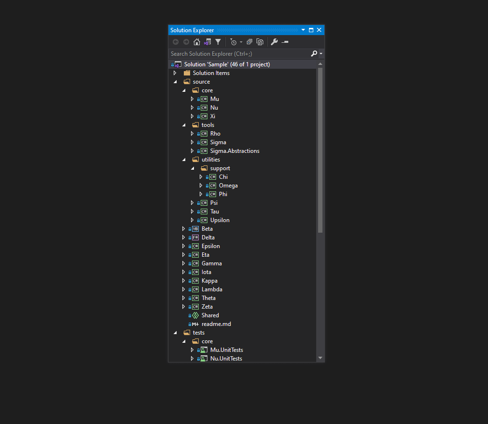
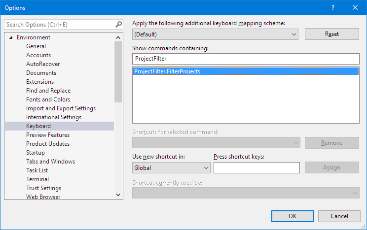

# Project Filter

A Visual Studio extension to quickly load and unload projects. Perfect for large solutions.

## Installation

Get the extension from the [Visual Studio Marketplace](https://marketplace.visualstudio.com/items?itemName=reduckted.ProjectFilter), or search for "Project Filter" in Visual Studio's _Manage Extensions_ dialog.

## How To Use

Once the extension is installed, a _Filter Projects_ button will be shown in Solution Explorer. That button will open the _Project Filter_ dialog. Simply tick on the projects that you want loaded and untick the projects that you want unloaded, then click _OK_. You can also choose to load all project dependencies of the projects that are loaded.

## Keyboard Shortcuts

The _Filter Projects_ button is not bound to a keyboard shortcut, but you can assign one yourself. The command name is `ProjectFilter.FilterProjects`.

The _Project Filter_ dialog comes with some keyboard shortcuts.

| Key Combination             | Action                                                        |
| --------------------------- | ------------------------------------------------------------- |
| <kbd>Alt</kbd>+<kbd>L</kbd> | Toggle the _Load dependencies of the loaded projects_ option. |
| <kbd>Alt</kbd>+<kbd>A</kbd> | Tick all projects shown in the tree.                          |
| <kbd>Alt</kbd>+<kbd>Z</kbd> | Untick all projects shown in the tree.                        |
| <kbd>Alt</kbd>+<kbd>=</kbd> | Expand all nodes in the tree.                                 |
| <kbd>Alt</kbd>+<kbd>-</kbd> | Collapse all nodes in the tree.                               |

The shortcuts to check or uncheck all projects will only change the projects shown in the tree. This means you can filter the tree using the search box, and then check or uncheck the results without affecting projects that did not meet the filter.
